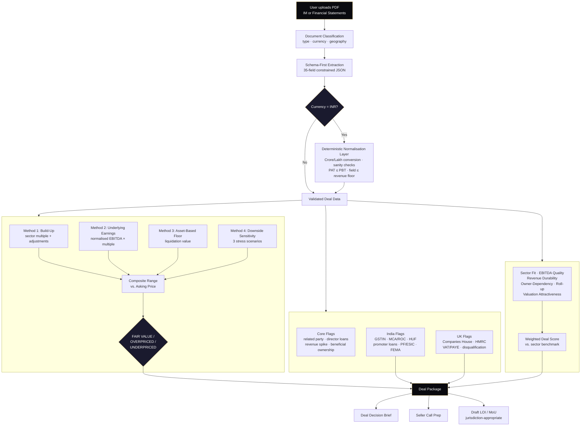

# Deal OS

**AI-powered deal analysis infrastructure for SME acquisitions.**

Deal OS takes a private company Information Memorandum and returns structured financial analysis, an independent valuation, a compliance risk screen, and a draft Letter of Intent — in under two minutes. Built for solo acquisition entrepreneurs, search fund principals, and independent sponsors who don't have analyst support.

**Live product:** [clearline-deal-os.vercel.app](https://clearline-deal-os.vercel.app)

---

## The problem

Search fund principals and independent sponsors acquiring SME businesses (£1M–£20M in the UK, ₹5Cr–₹200Cr in India) typically screen 8–15 deals a month with no dedicated analyst. Each deal requires 3–4 hours of manual work: reading a 30–40 page PDF, rebuilding a financial model from scratch in Excel, manually researching compliance red flags across multiple government registries, and drafting a Heads of Terms or MoU by hand. Existing tools either target institutional deal teams at price points and complexity unsuited to solo operators, or are generic AI assistants with no grounding in deal-specific data or jurisdiction-specific compliance logic.

## What Deal OS does

A single PDF upload triggers a five-stage pipeline:

1. **Document classification and extraction** — detects document type (IM vs. financial statements), currency, and geography, then extracts 35 structured financial and deal-term fields using a constrained JSON schema (the model fills slots; it cannot invent fields not present in the source document).
2. **Independent valuation (BAUS engine)** — four parallel valuation methods: Build-up (sector-multiple-driven), Underlying Earnings (normalised EBITDA), Asset-Based Floor, and Downside Sensitivity. Benchmarked against Damodaran sector data with a private-market discount applied, and reconciled against the stated asking price to produce a FAIR VALUE / OVERPRICED / UNDERPRICED verdict.
3. **ECRM risk screening** — a 9-category compliance and governance screen (related party transactions, director loans, revenue spikes, beneficial ownership, regulatory flags) with jurisdiction-specific extensions: UK (Companies House, HMRC, VAT/PAYE, director disqualification) and India (GSTIN, MCA/ROC, promoter loans, HUF structures, GST compliance, PF/ESIC).
4. **Deal scoring** — a six-dimension weighted score (sector fit, EBITDA quality, revenue durability, owner-dependency, roll-up potential, valuation attractiveness) benchmarked against sector medians.
5. **Document generation** — a structured deal decision brief, seller call preparation document, and a jurisdiction-appropriate draft LOI (UK Heads of Terms / Indian MoU).

## Geography support

| Market | Currency handling | ECRM coverage | LOI template | Status |
|---|---|---|---|---|
| 🇬🇧 United Kingdom | GBP | Companies House, HMRC, VAT/PAYE, director disqualification | Heads of Terms (English law) | Production |
| 🇮🇳 India | INR with deterministic Crore/Lakh normalisation | GSTIN, MCA/ROC, promoter loans, HUF structures, GST compliance, PF/ESIC, FEMA/RBI | MoU (Indian contract law) | Production |
| 🇦🇪 UAE | AED/USD | DIFC compliance, UBO disclosure | In development | Beta |

## Architecture

**Stack:** React 18 (Vite) · Supabase (Postgres, auth, RLS) · LLM-based extraction (Groq/Llama, migrating to Claude Sonnet) · Vercel deployment.

**Key engineering decisions:**

- **Schema-first extraction, not free-form generation.** The LLM is constrained to a fixed 35-field JSON schema per deal. This eliminates field drift and makes downstream calculations (valuation, scoring) deterministic given a correct extraction.
- **Deterministic currency normalisation, not LLM arithmetic.** Indian Crore/Lakh notation (a non-Western, non-trivial-to-parse numbering convention) is unreliable when left to model-level arithmetic. Currency normalisation is implemented as a post-extraction JavaScript validation layer with anchor-based sanity checks (e.g., no P&L line item may exceed total revenue; PAT cannot exceed PBT) rather than relying on the model to convert units correctly on every call.
- **Multi-tenant by default.** All reads and writes are scoped by `user_id` with Supabase Row Level Security; session state is cleared on auth state changes to prevent cross-session data leakage.
- **Deterministic guardrails over LLM judgment for compliance thresholds.** Flag thresholds (e.g., revenue growth >25% triggers a `revenue_spike` flag) are enforced in application code as a post-processing step over the LLM's raw output, rather than trusted to model instruction-following alone.

## Tech & skills demonstrated

`React` · `JavaScript/TypeScript` · `Supabase (Postgres, Auth, RLS)` · `LLM prompt engineering & structured extraction` · `Financial modelling (DCF/multiples-based valuation methodology)` · `Multi-tenant SaaS architecture` · `Cross-jurisdiction regulatory logic (UK & India)` · `API integration` · `Data validation & deterministic guardrails around probabilistic systems`

## Roadmap

- [ ] US and EU geography support (SBA-aware financing logic, EU multi-jurisdiction LOI)
- [ ] Stripe / Razorpay billing integration
- [ ] Official Companies House and MCA21 API integration (replacing interim data sources, held up by Companies House API provider themselves)

## Status

Live and in active use by early search fund operators in the UK and India. Built and maintained solo.

*This is a product I am actively building and selling, alongside seeking full-time opportunities in engineering, fintech, and applied AI roles — happy to talk about either.*

## Contact

Siddharth Padigar — [LinkedIn](https://www.linkedin.com/in/siddharth-padigar-590406213)
